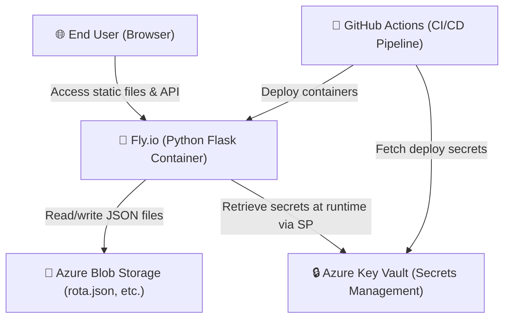

# 🏗️ System Architecture Overview

> **Stage 2 of 7 (Environment):** High-level system design, deployment layout, and component interaction.
> If the system architecture changes, developers and AI agents must update this document to keep it accurate.

---

## 🗺️ High-Level System Architecture

This project is built as a highly responsive, modern application deployed on **Fly.io** using a Python Flask backend. The backend serves both the static frontend (HTML/CSS/JS) and the REST API. Storage is handled via **Azure project-based storage** (Blob Storage), and credentials are retrieved from **Azure Key Vault** (RULE-003, RULE-004). 

---

## 🧩 Core Components

### 1. Frontend Static Layer (`index.html` & `script.js`)
- **Hosting:** Served by the Flask backend on Fly.io.
- **Styling & Assets:** Vanilla CSS styling, Fira Code / Outfit / Inter fonts, and FontAwesome icons loaded via CDN.
- **Data Editing:** Admin UI edits the volunteer and rota JSON arrays and saves directly to the backend API.

### 2. Backend API — Fly.io
- **Server:** Python Flask serving endpoints `/api/data/<entity>` for GET and POST.
- **Credentials:** Uses `DefaultAzureCredential` configured with Service Principal env variables in Fly.io to read the Key Vault.
- **Key Vault Secrets:** `ADMIN-PASSWORD` and `AZURE-STORAGE-CONNECTION-STRING`.

### 3. Data Layer — Azure Blob Storage
- **Container:** `rota` and `config` containers in `dpstoragebarrierduty` account.
- **Usage:** Holds `rota.json`, `updates.json`, `volunteers.json` which the Fly.io backend reads and writes.

### 4. CI/CD & Deployments
- **Pipeline:** GitHub Actions (`.github/workflows/fly.yml`) handles deployment to Fly.io on pushes to `main`.
- **Secrets:** Fly API token configured as a GitHub Secret.

> 📋 For a single reference covering every tool in the stack, see [`tools.md`](./tools.md).

---

## 🛠️ How to Keep This Document Updated

1. **Keep Diagrams in Sync:** If new components are added, update the Mermaid graph above.
2. **Review Environment Configs:** Ensure changes match `setup_mac.md`, `setup_windows.md`, etc.
3. **Verify Rendering:** Ensure that Mermaid rendering works on the compiled web page via `5_Symbols/markdown_renderer.html`.
